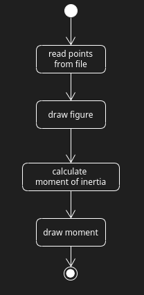

# OpenGL_InertiaMoment
Simple school project for rendering moment of inertia with usage of openGL library

## Goal
Program shall realize steps described in [General Activity](./detailed_design/general_activity.uxf)

### Supporting documentation
Equations and figures to figures for discretization can be found in [docs](<./doc/>)

### Code snippets

Compile attaching openGL `g++ file_name.cpp file_name.hpp -o output_name -lglut -lGL -lGLU`